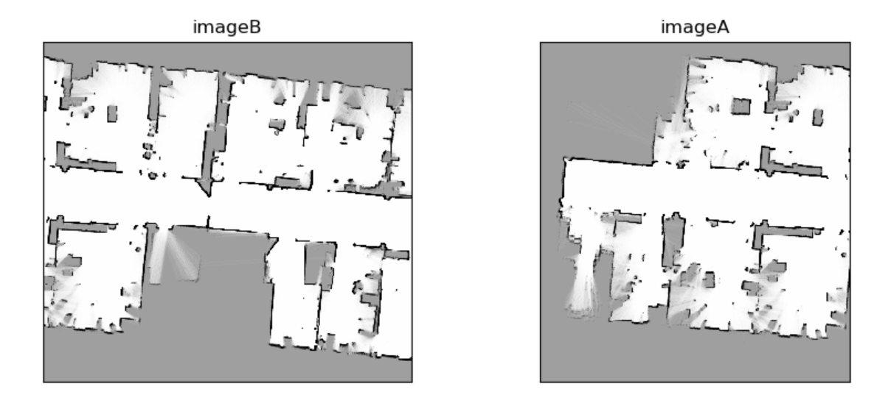
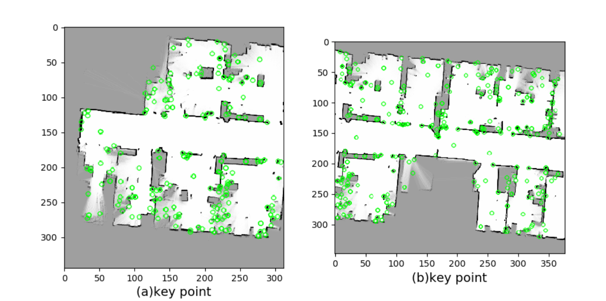
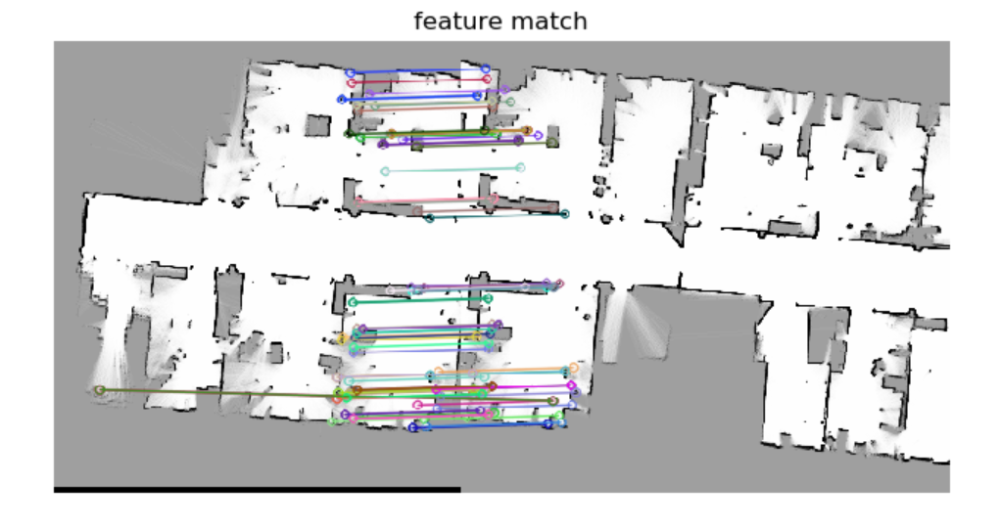
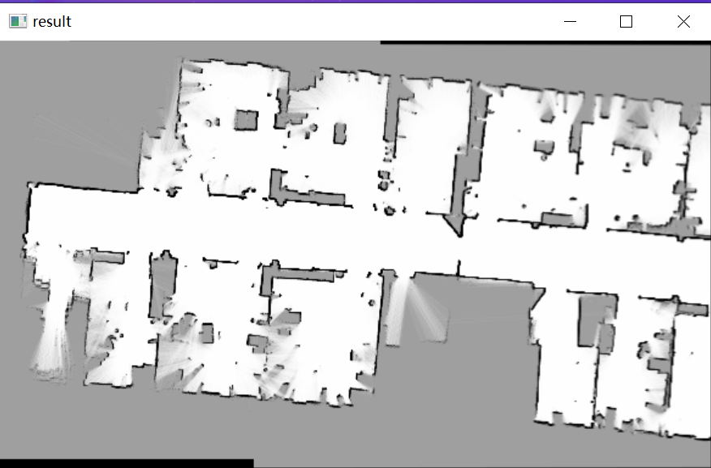
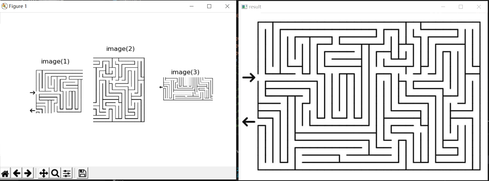
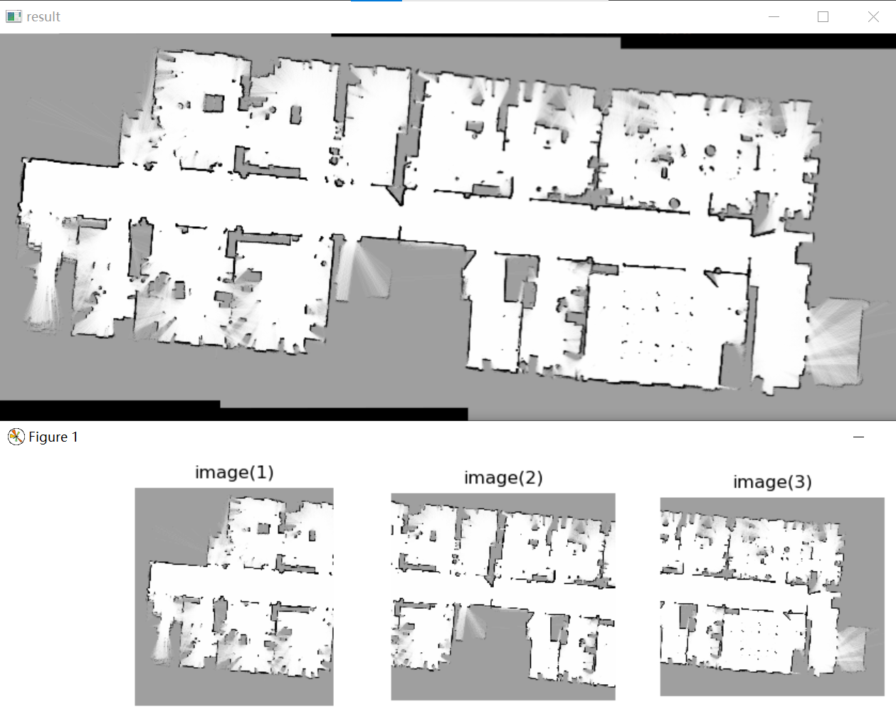

# 基于opencv的图像拼接

## 问题

自动控制创新实践要求合并多机器人的slam地图，既合并有重叠部分的两张或多张图片， 比如说下面两张图片



## 1. 特征检测

使用SIFT算法进行特征检测，得到特征图



## 2.对特征进行K近邻算法进行匹配

得到匹配结果



## 3. 计算其中一张图的透视针对另一张图的透视变换

* 由于无法提前知道两张图片的位置关系，对于透视变换，可能图片会映射到整个选取区域的左边，这样的话，无法正常显示图片，因此，要对透视变换后的图片进行面积检查，如果比原来的图片面积小太多，就用另一张图片来进行透视变换

```python
    """
    计算两张图的透视关系
    """
    matchCount = len(matches)
    M = getHomography(kpsA, kpsB, matches, reprojThresh=4)
    if M is None:
        print("Error!")
    (matches, H, status) = M
    """
    将图片A进行透视变换并检查图片位置
    """
    result = cv2.warpPerspective(imageA, H, ((imageA.shape[1] + imageB.shape[1])*2, (imageA.shape[0] + imageB.shape[0]) * 2))
    resultAfterCut = cutBlack(result)
    
    # 检查图片位置
    if np.size(resultAfterCut) < np.size(imageA) * 0.95:
        print("图片位置不对,将自动调换")
        # 调换图片
        kpsA,kpsB = swap(kpsA, kpsB)
        imageA, imageB = swap(imageA, imageB)
        if feature_matching == 'bf':
            matches = matchKeyPointsBF(featuresB, featuresA, method=feature_extractor)
        elif feature_matching == 'knn':
            matches = matchKeyPointsKNN(featuresB, featuresA, ratio=0.75, method=feature_extractor)
            if len(matches) < 10:
                return None
        matchCount = len(matches)
        M = getHomography(kpsA, kpsB, matches, reprojThresh=4)
        if M is None:
            print("Error!")
        (matches, H, status) = M
    
```

## 4. 合并图片，大功告成

得到结果图，合并效果很完美



# 如何进行多张图片的合并

**很简单，反复调用合并两张图片就行**，但是有些细节问题，**无法提前得知多张图片的位置，先合并哪个？**

既然我们有特征匹配环节，优先合并匹配特征数多的就行。

## 多张图片的效果图

第一个迷宫图



第二个slam地图



效果还行。

# 完整代码

注释很详细，不用怕看不懂

```python
import cv2
import numpy as np
import matplotlib.pyplot as plt
import math
from numpy.core.defchararray import array

# ================================================================== #
#                     选择特征提取器函数                             
# ================================================================== #
def detectAndDescribe(image, method=None):
    assert method is not None, "You need to define a feature detection method. Values are: 'sift', 'surf'"
    if method == 'sift':
        descriptor = cv2.xfeatures2d.SIFT_create()
    elif method == 'surf':
        descriptor = cv2.xfeatures2d.SURF_create()
    elif method == 'brisk':
        descriptor = cv2.BRISK_create()
    elif method == 'orb':
        descriptor = cv2.ORB_create()
    (kps, features) = descriptor.detectAndCompute(image, None)
    return (kps, features)
# ================================================================== #
#                     暴力检测函数                             
# ================================================================== #
def matchKeyPointsBF(featuresA, featuresB, method):
    bf = createMatcher(method, crossCheck=True)
    best_matches = bf.match(featuresA,featuresB)
    rawMatches = sorted(best_matches, key = lambda x:x.distance)
    print("Raw matches (Brute force):", len(rawMatches))
    return rawMatches
# ================================================================== #
#                     使用knn检测函数                            
# ================================================================== #
def matchKeyPointsKNN(featuresA, featuresB, ratio, method):
    bf = createMatcher(method, crossCheck=False)
    rawMatches = bf.knnMatch(featuresA, featuresB, 2)
    # print("Raw matches (knn):", len(rawMatches))
    matches = []
    for m,n in rawMatches:
        if m.distance < n.distance * ratio:
            matches.append(m)
    # print(f"knn匹配的特征点数量:{len(matches)}")
    return matches
# ================================================================== #
#                                                  
# ================================================================== #
def createMatcher(method,crossCheck):
    "Create and return a Matcher Object"
    if method == 'sift' or method == 'surf':
        bf = cv2.BFMatcher(cv2.NORM_L2, crossCheck=crossCheck)
    elif method == 'orb' or method == 'brisk':
        bf = cv2.BFMatcher(cv2.NORM_HAMMING, crossCheck=crossCheck)
    return bf
# ================================================================== #
#                     计算关键点的透视关系                     
# ================================================================== #
def getHomography(kpsA, kpsB, matches, reprojThresh):
    # convert the keypoints to numpy arrays
    kpsA = np.float32([kp.pt for kp in kpsA])
    kpsB = np.float32([kp.pt for kp in kpsB])
    if len(matches) > 4:
        # construct the two sets of points
        ptsA = np.float32([kpsA[m.queryIdx] for m in matches])
        ptsB = np.float32([kpsB[m.trainIdx] for m in matches])
        
        # estimate the homography between the sets of points
        (H, status) = cv2.findHomography(ptsA, ptsB, cv2.RANSAC,
            reprojThresh)
        return (matches, H, status)
    else:
        return None
# ================================================================== #
#                     去除图像黑边                     
# ================================================================== #
def cutBlack(pic):
    rows, cols = np.where(pic[:,:,0] !=0)
    min_row, max_row = min(rows), max(rows) +1
    min_col, max_col = min(cols), max(cols) +1
    return pic[min_row:max_row,min_col:max_col,:]
# ================================================================== #
#                     调换                     
# ================================================================== #
def swap(a, b):
    return b,a
# ================================================================== #
#                     主要的函数
#                合并两张图（合并多张图基于此函数）                          
# ================================================================== #
def handle(path1, path2, isShow = False):
    """
    定义超参数
    """
    feature_extractor = 'sift'
    feature_matching = 'knn'
    """
    读取原始图像
    """
    if isinstance(path2,str):
        imageA = cv2.imread(path2)
        imageA = cv2.cvtColor(imageA,cv2.COLOR_BGR2RGB)
    else:
        imageA = path2
    imageA_gray = cv2.cvtColor(imageA, cv2.COLOR_RGB2GRAY)
    if isinstance(path1,str):
        imageB = cv2.imread(path1)
        imageB = cv2.cvtColor(imageB,cv2.COLOR_BGR2RGB)
    else:
        imageB = path1
    t = np.size(imageB)
    imageB_gray = cv2.cvtColor(imageB, cv2.COLOR_RGB2GRAY)
    """
    显示输入的两张图片
    """
    if isShow:
        f = plt.figure(figsize=(10,4))
        f.add_subplot(1,2,1)
        plt.title("imageB")
        plt.imshow(imageB)
        plt.xticks([]),plt.yticks([])
        f.add_subplot(1,2,2)
        plt.title("imageA")
        plt.imshow(imageA)
        plt.xticks([]),plt.yticks([])
    """
    提取两证图片的特征
    """
    kpsA, featuresA = detectAndDescribe(imageA_gray, method=feature_extractor)
    kpsB, featuresB = detectAndDescribe(imageB_gray, method=feature_extractor)
    """
    显示关键点
    """
    if isShow:
        fig, (ax1,ax2) = plt.subplots(nrows=1, ncols=2, figsize=(10,4), constrained_layout=False)
        ax1.imshow(cv2.drawKeypoints(imageA_gray,kpsA,None,color=(0,255,0)))
        ax1.set_xlabel("(a)key point", fontsize=14)
        ax2.imshow(cv2.drawKeypoints(imageB_gray,kpsB,None,color=(0,255,0)))
        ax2.set_xlabel("(b)key point", fontsize=14)

    """
    进行特征匹配
    """
    if feature_matching == 'bf':
        matches = matchKeyPointsBF(featuresA, featuresB, method=feature_extractor)
        img3 = cv2.drawMatches(imageA,kpsA,imageB,kpsB,matches[:100],
                            None,flags=cv2.DrawMatchesFlags_NOT_DRAW_SINGLE_POINTS)
    elif feature_matching == 'knn':
        matches = matchKeyPointsKNN(featuresA, featuresB, ratio=0.75, method=feature_extractor)
        if len(matches) < 10:
            return None
        img3 = cv2.drawMatches(imageA,kpsA,imageB,kpsB,np.random.choice(matches,100),
                            None,flags=cv2.DrawMatchesFlags_NOT_DRAW_SINGLE_POINTS)
    """
    匹配的特征展示
    """
    if isShow:
        fig = plt.figure(figsize=(10,4))
        plt.imshow(img3)
        plt.title("feature match")
        plt.axis('off')
    """
    计算两张图的透视关系
    """
    matchCount = len(matches)
    M = getHomography(kpsA, kpsB, matches, reprojThresh=4)
    if M is None:
        print("Error!")
    (matches, H, status) = M
    """
    将图片A进行透视变换并检查图片位置
    """
    result = cv2.warpPerspective(imageA, H, ((imageA.shape[1] + imageB.shape[1])*2, (imageA.shape[0] + imageB.shape[0]) * 2))
    resultAfterCut = cutBlack(result)
    
    # 检查图片位置
    if np.size(resultAfterCut) < np.size(imageA) * 0.95:
        print("图片位置不对,将自动调换")
        # 调换图片
        kpsA,kpsB = swap(kpsA, kpsB)
        imageA, imageB = swap(imageA, imageB)
        if feature_matching == 'bf':
            matches = matchKeyPointsBF(featuresB, featuresA, method=feature_extractor)
        elif feature_matching == 'knn':
            matches = matchKeyPointsKNN(featuresB, featuresA, ratio=0.75, method=feature_extractor)
            if len(matches) < 10:
                return None
        matchCount = len(matches)
        M = getHomography(kpsA, kpsB, matches, reprojThresh=4)
        if M is None:
            print("Error!")
        (matches, H, status) = M
        result = cv2.warpPerspective(imageA, H, ((imageA.shape[1] + imageB.shape[1])*2, (imageA.shape[0] + imageB.shape[0]) * 2))
    """
    合并图片
    """
    # cv2.imshow("Perspective transformation", result)
    # cv2.waitKey(0)
    result[0:imageB.shape[0], 0:imageB.shape[1]] = np.maximum(imageB, result[0:imageB.shape[0], 0:imageB.shape[1]]) 
    result = cutBlack(result)
    return result, matchCount
# ================================================================== #
#                     合并多张图                   
# ================================================================== #
def handleMulti(*args, isShow = False):
    print(isShow)
    l = len(args)
    if isShow:
        row = math.ceil(l / 3)
        
        f = plt.figure(figsize=(10, 4))
        for i in range(l):
            f.add_subplot(row, 3, i + 1)
            plt.title(f"image({i+1})")
            plt.axis("off")
            plt.imshow(cv2.cvtColor(cv2.imread(args[i]), cv2.COLOR_BGR2RGB))
    assert(l > 1)
    isHandle = [0 for i in range(l - 1)]
    nowPic = args[0]
    args = args[1:]
    for j in range(l - 1):
        isHas = False # 在一轮中是否找到
        matchCountList = []
        resultList = []
        indexList = []
        for i in range(l - 1):
            if (isHandle[i] == 1):
                continue
            result, matchCount = handle(nowPic, args[i])
            if not result is None:
                matchCountList.append(matchCount)
                resultList.append(result)
                indexList.append(i)
                isHas = True
        if not isHas: # 一轮找完都没有可以合并的
            return None
        else:
            index = matchCountList.index(max(matchCountList))
            nowPic = resultList[index]
            isHandle[indexList[index]] = 1
            print(f"合并第{indexList[index] + 2}个")
            # cv2.imshow("temp", nowPic)
            # cv2.waitKey(0)
    return nowPic

# ================================================================== #
#                     主函数                   
# ================================================================== #
if __name__ == "__main__":
    """
    处理两张图，可以打印特征点与对应关系
    """
    result, _ = handle("./input/222.png", "./input/111.png", isShow=True)
    if not result is None:
        cv2.imshow("result", result[:, :, [2, 1, 0]])
        plt.show()
        cv2.waitKey(0)
    else:
        print("没有找到对应特征点,无法合并")
    exit()

    """
    处理多张图，不可以打印特征点与对应关系
    """
    # result = handleMulti(
    #                     "./input/migong (1).png",
    #                     "./input/migong (2).png",
    #                     "./input/migong (3).png",
    #                      isShow=True)
    # result = handleMulti("./input/111.png", "./input/222.png","./input/333.png", isShow=True)
    # result = handleMulti("./input/foto7A.jpg", "./input/foto7B.jpg") #合并的不好的图
    result = handleMulti("./input/intel_lab (1).png",
                        "./input/intel_lab (2).png",
                        "./input/intel_lab (3).png",
                        "./input/intel_lab (4).png",
                        "./input/intel_lab (5).png",
                        "./input/intel_lab (6).png",
                        isShow=True)
    if not result is None:
        cv2.imshow("result", result[:, :, [2, 1, 0]])
        plt.show()
        cv2.waitKey(0)
    else:
        print("没有找到对应特征点,无法合并")
```

